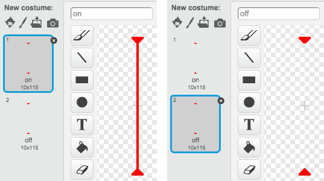

---
title: Uhýbání balónům
level: Scratch 2
language: en-GB
stylesheet: scratch
embeds: "*.png"
materials: ["Club Leader Resources/*","Project Resources/*"]
...

# Introduction { .intro }

V tomto projektu se naučíš, jak vytovřit plošinovou hru, ve které se musíě vyhnout pohybujícím balónům a dosáhnout konce každé úrovně.

<div class="scratch-preview">
  <iframe allowtransparency="true" width="485" height="402" src="http://scratch.mit.edu/projects/embed/39740618/?autostart=false" frameborder="0"></iframe>
  
</div>

# Krok 1: Character movement { .activity }

Začni vytvořením postavy, které se může pohybovat doleva a doprava a lézt nahoru po stožárech.

## Seznam úkolů { .check }

+ Vytvoř si nový projekt a smaž kočičku, takže tvůj projekt bude prázdný. Online editor můžeš nalézt zde: <a href="http://jumpto.cc/scratch-new">jumpto.cc/scratch-new</a>.

+ Pro tento projekt potřebuješ adresář 'Project Resources',který obsahuje potřebné pozadí pro hru. Ujsiti se, že tento adresář máš, případně se na něj zeptej vedoucího klubu.

	

+ Přidej obrázek 'background.png' jako nové pozadí scény nebo si nakresli vlastní! Pokud si kreslíš vlastní, ujisti se, že mají stožáry a podlaha jinou barvu a že existují nějaké dveře, či něco podobného, co má hráč jako cíl k dosažení. Takto by měl vypadat tvůj projekt:

	

+ Přidej novou postavu, se ktterou budeš hrát. Vyber postavu s více kostýmy, tak aby se dala animovat chůze.

	

+ POužij šipky pro ovládání postavy. Pokud hráč stiskne šipku doprava, měla by se psotava otočit doprava, pohnout a změnit kostým:

	```blocks
		po kliknutí na ⚑
		opakuj dokola
			když <klávesa [šipka vpravo v] stisknuta? > tak
				natoč se směrem (90 v)
				posuň se o (3) kroků
				další kostým
			end
		end
	```

+ Otestuj postavu kliknutím na zelenou vlakku a tak, že podržíš šipku doprava. Pohybuje se doprava a vypadá to jako že chodí?

	

+ Aby se tvoje postava pohybovala doleva, přidej další blok `když` {.blockcontrol} do smyčky `opakuj dokola` {.blockcontrol}, který bude posouvat postavu doleva. Nezapomeň otestovat tvůj nový kód!

+ Pro lezení na stožáry musí být splněna podmínka, že je stisknut šipka nahoru a tvoje postava se dotýká správné barvy. přidej tento kód do smyčky `opakuj dokola` {.blockcontrol}:

	```blocks
		když < <klávesa [šipka nahoru v] stisknuta?> a <dotýká se barvy [#FFFF00]?> > tak
			změň y o (4)
		end
	```

+ Vyzkoušej svoji postavu - může šplhat po žlutých stožárech a dostat se tak o úroveň výš?

	

## Ulož projekt { .save }

## Výzva: Ukončení úrovněl {.challenge}
Zvládneš přidat kód k postavě, tak aby něco řekla `když` {.blockcontrol} se dostane k hnědým dveřím?


## Ulož projekt { .save }

# Krok 2: Gravitace a skákání { .activity }

Pojď upravit tvoji postavičku tak, aby byla více realistická přidáním gravitace a možnosti skákání.

## Seznam úkolů { .check }

+ Určitě sis všiml(a), že postavička může chodit mimo plošinu do vzduchu. Zkus to a podívej se co se dějě.

	

+ Pro opravu musíš přidat do hry gravitaci. Vytvoř proměnnou nazvanou `gravitace` {.blockdata}. Skryj ji ze scény, pokud chceš.

	

+ Přidej tento nový kód, který nastaví gravitaci na záporné číslo a pak ji použije na změnu y pozice tvé postavy.

	```blocks
		po kliknutí na ⚑
		nastav[gravitace v] na [-4]
		opakuj dokola
			změň y o (gravitace)
		end
	```

+ Klikni na vlajku a přetáhni postavu nahoru na scéně. Co se stane? Funguje gravitace, tak jak jsi čekal(a)?

	

+ Gravitace nesmí hýbat postavou skrz plošinu nebo stožáry! Přidej blok `když` {.blockcontrol} tak, aby gravitace fungovala jen když je postava ve vzduchu:

	```blocks
		po kliknutí na ⚑
		set [gravity v] to [-4]
		opakuj dokola
			když < není < <dotýká se barvy [#0000FF]?> nebo <dotýká se barvy [#FFFF00]?> > > tak
				změn y o (gravitace)
			end
		end
	```

+ Vyzkošej znova gravitaci. Zastaví se postava na plošině nebo stožáru? Může se dostat přes hranu plošiny o úroveň níže?

	

+  Uprav postavu tak, aby skákala když hráč stiskne mezerník:

	```blocks
		po stisku klávesy [mezerník v]
		opakuj (10)
			změň y o (4)
		end
	```

	Protože gravitace tlačí postavu stále dolů o 4 pixely, musíš zvolit číslo větší než 4 v bloku `změň y o (4)` {.blockmotion}. Měń to číslo tak dlouho, dokud nejsi spokojen(ý) s výškou skoku.

+ Když vyzkouší svůj kód, tak si všimneš, že skákání není moc plynulé. Proto se musí postava posouvat o stále menší číslo, dokud nepřestane skákat.

+ Vytvoř proměnnou `vyska skoku` {.blockdata}. Opět můžeš skrýt tuto proměnnou, pokud chceš.

+ Smaž skákací kód a nahraď ho následujícím:

	```blocks
		po stisku klávesy [mezerník v]
		nastav [vyska skoku v] na [8]
		opakuj dokud nenastane < (vyska skoku) = [0] >
			změń y o (vyska skoku)
			změń [vyska skoku v] o (-0.5)
		end
	```

	Tento kód posune postavu o 8 pixelů, potom o 7.5 pixelů, potom o 7 pixelů atd. dokud postava nedokončí skok.

+ Měň výchozí hodnotu proměnné `vyska skoku` {.blockdata} a testuj dokud nejsi spokojený(á).

## Ulož projekt { .save }

## Výzva: Improved jumping {.challenge}
Postava může vyskočit, kdykoliv je stiknut mezerník, i když je ve vzduchu. Vyzkoušej to tak, že během pádu z plošiny podržíš mezerník. Múžeš to opravit tak, že postava může skákat jen `když` {.blockcontrol} se dotýka plošiny?

## Ulož projekt { .save }

# Krok 3: Uhýbání balónům { .activity .new-page}

Now that you've got your character moving around, let's add some balls for your character to avoid.

## Seznam úkolů { .check }

+ Create a new ball sprite. You can choose any type of ball you like.

	

+ Resize your ball, so that your character can jump over it. Try jumping over the ball to test it. 

	

+ Add this code to your ball:

	

	This code creates a new ball clone every 3 seconds. Each new clone moves along the top platform.

+ Click the flag to test this out.

	

+ Add more code to your ball sprite, so that they move across all 3 platforms.

	

+ Finally, you'll need code for when your character gets hit by a ball! Add this code to your ball sprite:

	```blocks
		when I start as a clone
		forever
			if < touching [Pico walking v]? > then
				broadcast [hit v]
			end
		end
	```

+ You'll also need to add code to your character, to move back to the start when they're hit:

	```blocks
		when I receive [hit v]
		point in direction (90 v)
		go to x: (-210) y: (-120)
	```	

+ Test out your character and see if they go back to the start when they've been hit by a ball.

## Ulož projekt { .save }

## Výzva: Random balls {.challenge}
The balls your character has to dodge all look the same, and always appear every 3 seconds. Can you improve them, so that they:

+ don't all look the same?
+ appear after a random amount of time?
+ are a random size?


## Ulož projekt { .save }

# Krok 4: Lasers! { .activity .new-page}

Let's make your game a little harder to complete, by adding lasers!

## Seznam úkolů { .check }

+ Add a new sprite to your game, called 'Laser'. It should have 2 costumes, called 'on' and 'off'.

	

+ Place your new laser anywhere you like, between 2 platforms.

	

+ Add code to your laser, to make it switch between the 2 costumes.

	```blocks
		po kliknutí na ⚑
		forever
			switch costume to [on v]
			wait (2) secs
			switch costume to [off v]
			wait (2) secs
		end
	```

	If you prefer, you can `wait` {.blockcontrol} a `random` {.blockoperators} amount of time between costume changes.

+ Finally, add code to your laser, so that the 'hit' message is broadcast when the laser touches your character. This code will be the same as the code you added to your ball sprite.

	You don't need to add any more code to your character - they already know what to do when they get hit!

+ Test out your game to see if you can get past the laser. Change the `wait` {.blockcontrol} times in your code if the lasers are too easy or too hard.

## Výzva: More obstacles {.challenge}
If you think your game is still too easy, you can add more obstacles to your level. You can add anything you like, but here are some ideas:

+ A flying killer butterfly;
+ Platforms that appear and disappear;
+ Falling tennis balls that must be avoided.


You could even create more than one backdrop, and move to the next level when your character reaches the brown door:

```blocks
	if <touching color [#714300]?> then
		switch backdrop to [next backdrop v]
		go to x: (-210) y: (-120)
		wait (1) secs
	end
```

## Ulož projekt { .save }

## Výzva: Improved gravity {.challenge}
There's one other small bug in your game: gravity doesn't pull your character downwards if _any_ part of it is touching a blue platform - even it's head! You can test this out by climbing most of the way up a pole and then moving to the left.


Can you fix this bug? To do this, you need to give your character different coloured trousers (on _all_ costumes)...


...and then replace the code: 

```blocks
	< touching color [#0000FF]? >
```

with:

```blocks
	< color [#00FF00] is touching [#0000FF]? >
```

Remember to test your improvements to make sure you've fixed the bug!

## Ulož projekt { .save }

## Výzva: More lives {.challenge}
Can you give your player 3 `lives` {.blockdata}, instead of just sending them back to the beginning each time? Here's how your game could work:

+ Your player starts with 3 lives;
+ Whenever your player gets hit, one life is lost and they go back to the start;
+ If there are no lives left, the game ends.

## Ulož projekt { .save }
