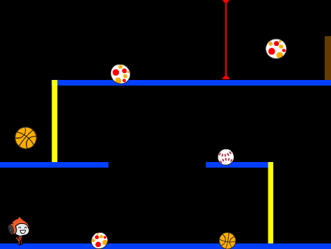
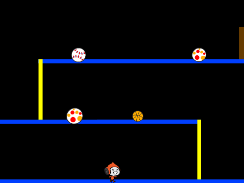
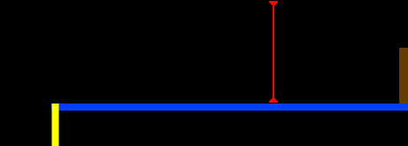

---
title: Uhýbání balónům
level: Scratch 2
language: cs-CZ
stylesheet: scratch
embeds: "*.png"
materials: ["Club Leader Resources/*","Project Resources/*"]
...

# Introduction { .intro }

V tomto projektu se naučíš, jak vytovřit plošinovou hru, ve které se musíě vyhnout pohybujícím balónům a dosáhnout konce každé úrovně.

<div class="scratch-preview">
  <iframe allowtransparency="true" width="485" height="402" src="http://scratch.mit.edu/projects/embed/39740618/?autostart=false" frameborder="0"></iframe>
  
</div>

# Krok 1: Pohyb postavy { .activity }

Začni vytvořením postavy, které se může pohybovat doleva a doprava a lézt nahoru po stožárech.

## Seznam úkolů { .check }

+ Vytvoř si nový projekt a smaž kočičku, takže tvůj projekt bude prázdný. Online editor můžeš nalézt zde: <a href="http://jumpto.cc/scratch-new">jumpto.cc/scratch-new</a>.

+ Pro tento projekt potřebuješ adresář 'Project Resources',který obsahuje potřebné pozadí pro hru. Ujsiti se, že tento adresář máš, případně se na něj zeptej vedoucího klubu.

	

+ Přidej obrázek 'background.png' jako nové pozadí scény nebo si nakresli vlastní! Pokud si kreslíš vlastní, ujisti se, že mají stožáry a podlaha jinou barvu a že existují nějaké dveře, či něco podobného, co má hráč jako cíl k dosažení. Takto by měl vypadat tvůj projekt:

	

+ Přidej novou postavu, se ktterou budeš hrát. Vyber postavu s více kostýmy, tak aby se dala animovat chůze.

	

+ Použij šipky pro ovládání postavy. Pokud hráč stiskne šipku doprava, měla by se postava otočit doprava, pohnout a změnit kostým: 
	
	```blocks
		po kliknutí na ⚑
		opakuj dokola
			když <klávesa [šipka vpravo v] stisknuta?> tak
				natoč se směrem (90 v)
				posuň se o (3) kroků
				další kostým
			end
		end
	```		

+ Otestuj postavu kliknutím na zelenou vlakku a tak, že podržíš šipku doprava. Pohybuje se doprava a vypadá to jako že chodí?

	

+ Aby se tvoje postava pohybovala doleva, přidej další blok `když` {.blockcontrol} do smyčky `opakuj dokola` {.blockcontrol}, který bude posouvat postavu doleva. Nezapomeň otestovat tvůj nový kód!

+ Pro lezení na stožáry musí být splněna podmínka, že je stisknut šipka nahoru a tvoje postava se dotýká správné barvy. přidej tento kód do smyčky `opakuj dokola` {.blockcontrol}:

	```blocks
		když < <klávesa [šipka nahoru v] stisknuta?> a <dotýká se barvy [#FFFF00]?> > tak
			změň y o (4)
		end
	```

+ Vyzkoušej svoji postavu - může šplhat po žlutých stožárech a dostat se tak o úroveň výš?

	

## Ulož projekt { .save }

## Výzva: Ukončení úrovněl {.challenge}
Zvládneš přidat kód k postavě, tak aby něco řekla `když` {.blockcontrol} se dostane k hnědým dveřím?


## Ulož projekt { .save }

# Krok 2: Gravitace a skákání { .activity }

Pojď upravit tvoji postavičku tak, aby byla více realistická přidáním gravitace a možnosti skákání.

## Seznam úkolů { .check }

+ Určitě sis všiml(a), že postavička může chodit mimo plošinu do vzduchu. Zkus to a podívej se co se dějě.

	

+ Pro opravu musíš přidat do hry gravitaci. Vytvoř proměnnou nazvanou `gravitace` {.blockdata}. Skryj ji ze scény, pokud chceš.

	

+ Přidej tento nový kód, který nastaví gravitaci na záporné číslo a pak ji použije na změnu y pozice tvé postavy.

	```blocks
		po kliknutí na ⚑
		nastav [gravitace v] na [-4]
		opakuj dokola
			změň y o (gravitace)
		end
	```

+ Klikni na vlajku a přetáhni postavu nahoru na scéně. Co se stane? Funguje gravitace, tak jak jsi čekal(a)?

	

+ Gravitace nesmí hýbat postavou skrz plošinu nebo stožáry! Přidej blok `když` {.blockcontrol} tak, aby gravitace fungovala jen když je postava ve vzduchu:

	```blocks
		po kliknutí na ⚑
		nastav [gravitace v] na [-4]
		opakuj dokola
			když < není < <dotýká se barvy [#0000FF]?> nebo <dotýká se barvy [#FFFF00]?> > > tak
				změn y o (gravitace)
			end
		end
	```

+ Vyzkošej znova gravitaci. Zastaví se postava na plošině nebo stožáru? Může se dostat přes hranu plošiny o úroveň níže?

	

+  Uprav postavu tak, aby skákala když hráč stiskne mezerník:

	```blocks
		po stisku klávesy [mezerník v]
		opakuj (10) krát
			změň y o (4)
		end
	```

	Protože gravitace tlačí postavu stále dolů o 4 pixely, musíš zvolit číslo větší než 4 v bloku `změň y o (4)` {.blockmotion}. Měń to číslo tak dlouho, dokud nejsi spokojen(ý) s výškou skoku.

+ Když vyzkouší svůj kód, tak si všimneš, že skákání není moc plynulé. Proto se musí postava posouvat o stále menší číslo, dokud nepřestane skákat.

+ Vytvoř proměnnou `vyska skoku` {.blockdata}. Opět můžeš skrýt tuto proměnnou, pokud chceš.

+ Smaž skákací kód a nahraď ho následujícím:

	```blocks
		po stisku klávesy [mezerník v]
		nastav [vyska skoku v] na [8]
		opakuj dokud nenastane < (vyska skoku) = [0] >
			změń y o (vyska skoku)
			změń [vyska skoku v] o (-0.5)
		end
	```

	Tento kód posune postavu o 8 pixelů, potom o 7.5 pixelů, potom o 7 pixelů atd. dokud postava nedokončí skok.

+ Měň výchozí hodnotu proměnné `vyska skoku` {.blockdata} a testuj dokud nejsi spokojený(á).

## Ulož projekt { .save }

## Výzva: Vylepšené skákáni {.challenge}
Postava může vyskočit, kdykoliv je stisknut mezerník, i když je ve vzduchu. Vyzkoušej to tak, že během pádu z plošiny podržíš mezerník. Múžeš to opravit tak, že postava může skákat jen `když` {.blockcontrol} se dotýka plošiny?

## Ulož projekt { .save }

# Krok 3: Uhýbání balónům { .activity .new-page}

Nyní, když máš postavu, která se pohybuje, přidej nějaké balóny, kterým se bude vyhýbat.

## Seznam úkolů { .check }

+ Přidej nový objekt pro balón, vyber jakýkoliv se ti bude líbit..

	

+ Změn velikost tak, aby byla tvoje postava schopná ho přeskočit. Zkus ho přeskočit, abys to vyzkoušel(a). 

	

+ Přidej k balónu následující kód:

	

	Tento kód vytvoří kopii balónu každé tři vteřiny. Každý klon přesune nad horní plošinu.

+ Klikni na vlajku a vyzkoušej to.

	

+ Přidej k balónu více kódu, aby se pohyboval přes všechny plošiny.

	

+ Nakonec budeš potřebovat kód, když balón trefí postavu! Přidej k balónu tento kód:

	```blocks
		když startuji jako klon
		opakuj dokola
			když < dotýká se [Pico walking v]? > tak
				rozešli všem [hit v]
			end
		end
	```

+ K postavě musíš přidat kód, který ji přesune po zásahu balónem na začátek:

	```blocks
		po obdržení zprávy [hit v]
		natoč se směrem (90 v)
		skoč na pozici x: (-210) y: (-120)
	```	

+ Otestuj postavičku a vyzkoušej, jestli se po zásahu balónem dostane zpět na začátek.

## Ulož projekt { .save }

## Výzva: Náhodné balóny {.challenge}
Balóny, kterým se tvoje postava vyhýbá jsou stále stejné a objevují se vždy po 3 vteřinách. Může vylepšit hru tak, aby:

+ nevypadaly vždy stejně?
+ objevovaly se po náhodném čase?
+ měly různou velikost?



## Ulož projekt { .save }

# Krok 4: Lejzry! { .activity .new-page}

Udělejme hru těžší přidáním lejzrů!

## Seznam úkolů { .check }

+ Přidej nový objekt a nazvi ho 'Laser'. Musí mít dva kostýmy nazvané 'on' a 'off'.

	

+ Umísti lejzr kamkoliv chceš mezi dvě plošiny.

	

+ Přidej k lejzru kód, který bude kostýmy přepínat.

	```blocks
		po kliknutí na ⚑
		opakuj dokola
			změň kostým na [on v]
			čekej (2) sekund
			změň kostým na [off v]
			čekej (2) sekund
		end
	```

	Pokud chceš, můžeš `čekat` {.blockcontrol} `náhodné` {.blockoperators} množství času, mezi změnami kostýmu.

+ Nakonec přidej lejzru kód, která pošle zprávu 'hit', když zasáhne hráče. Ten bude stejný, jako je u balónu.

	K postavě není třeba dávat žádný kód, ta už ví, jak se chovat, když je zasažena!

+ Vyzkoušej hru, jestli se dá dostat skrz lejzr. Změn blok `čekej` {.blockcontrol} pokud je průchod moc těžký nebo lehký.

## Výzva: Více překážek {.challenge}
Pokud si myslíš, že je hra moc jednoduchá, přidej více překážek. Přidej cokoliv chceš, ale zde je pár nápadů:

+ Lítající nebezpečný motýl;
+ Plošina, která se objevuje a mizí;
+ Padající tenisový míček, kterému se musíš vyhnut.


Navíc múžeš vytvořit více pozadí a přesunout hráče do další úrovně, když se dostane ke dveřím:

```blocks
	když <dotýká se barvy [#714300]?> tak
		změň pozadí na [další pozadí v]
		skoč na pozici x: (-210) y: (-120)
		čekej (1) sekund
	end
```

## Ulož projekt { .save }

## Výzva: Vylepšená gravitace {.challenge}
Ve hře je jedna malá chyba: gravitace nestáhne postavu dolů když se _jakákoliv_ část dotýká modré plošiny - i když je to hlava! Otestovat to můžeš tak, že vyšplháš po stožáru skoro nahoru a pak se posuneš do strany.


Zkusíš to opravit? Aby se to povedlo, musíš přidat postavě jinak barevné kalhoty (na _všech_ kostýmecch)...


...a pak nahraď kód: 

```blocks
	< dotýka se barvy [#0000FF]? >
```

tímto:

```blocks
	< barva [#00FF00] je na barvě [#0000FF]? >
```

Nezapomeň toto vylepšení otestovat!

## Ulož projekt { .save }

## Výzva: Více životů {.challenge}
Dej hráči 3 `životy` {.blockdata} místo toho, abys ho posílal vždy jen na začátek. Tady je příklad, jak by to mohlo vypadat:

+ Hráč začne se třemi životy;
+ Kdykoliv dostane zásah, tak ho pošli na začátek a uber život;
+ Když mu nezbudou životy, hra končí.

## Ulož projekt { .save }
