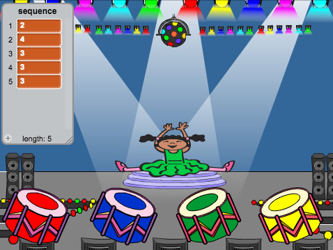
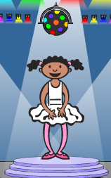

---
title: Paměť
level: Scratch 2
language: cs-CZ
stylesheet: scratch
embeds: "*.png"
materials: ["Club Leader Resources/*"]
...

## Komunitní projekt { .challenge .pdf-hidden }
Tento projekt byl vytvořen Erikem a jeho dcerou Ruth. Pokud chcete také přispět vlastním projektem potom můžete na [Githubu](https://github.com/CodeClub).

# Úvod { .intro }

V tomto projektu se naučíš jak vytovořit hru na cvičení paměťi, budeš se snažit zapamatovat si a zopakovat sekvenci náhodných barev!

<div class="scratch-preview">
  <iframe allowtransparency="true" width="485" height="402" src="http://scratch.mit.edu/projects/embed/34874510/?autostart=false" frameborder="0"></iframe>
  
</div>

# Krok 1: Náhodné barvy { .activity }

Jako první vytvoříme psotavu, která bude meěnit barvy v náhodné sekvenci a hráč si je zkusí zapamatovat.

## Seznam úkolů { .check }

+ Vytvoř si nový projekt a smaž kočičku, takže tvůj projekt bude prázdný. Online editor můžeš nalézt zde: <a href="http://jumpto.cc/scratch-new">jumpto.cc/scratch-new</a>.

+ Vyber si postavu a pozadí. Tvoje postava nemusí být člověk, ale musí umožňovat měnit a ukazovat různé barvy.

	

+ Ve hře použiješ různá čísla pro reprezentaci každé barvy:

	+ 1 = červená;
	+ 2 = modrá;
	+ 3 = zelená;
	+ 4 = žlutá.

	Vytvoř postavě 4 kostýmy, každý v jedné barvě. Ujisti se, že jsou barevné kostýmy ve správném pořadí.

	

+ Pro vytvoření náhodné sekvence musíš vytvořit __seznam__. Seznam je proměnná, která uschovává další data __v pořadí__. Vytvoř seznam nazvaný `sekvence` {.blockdata}. Protože seznam potřebuje vidět jen tato postava, zaškrtneme 'Jen pro tuto postavu'.

	

	Teď by měl být vidět na scéně vlevo nahoře prázdný seznam a přibýt bloky kódu pro práci s ním.

	

+ Add this code to your character, to add a random number to your list (and show the correct costume) 5 times:

	```blocks
		po kliknutí na ⚑
		zruš (všechno v) z [seznam v]
		opakuj (5) krát
			přidej (náhodné číslo od (1) do (4)) k [seznam v]
			změň kostým na (prvek (poslední v) z [seznam v])
			čekej (1) sekund
		end
	```

	všimni si, že musíš taky na začátku vyprázdnit seznam.

## Výzva: Přidání zvuků {.challenge}
Vyzkoušej projekt víckrát za sebou. Můžeš si všimnout, že se občas vybere stejná barva dvakrát nebo víckrát za sebou a je pak těžší zjsitit kolik jich bylo a zapamatovat si je. Přidej zvuk bubnu, pokaždé když postava změní kostým.

Zkus použít pokaždé jiný zvuk, aby odpovídal barvě. Toto je _velmi_ podobné tomu, jak měníš kostýmy.

## Ulož projekt { .save }

# Krok 2: Zopakování sekvence { .activity }

Přidej 4 tlačítka, kterýmí hráč zopakuje sekvenci barev, kterou si zapamatoval.

## Seznam úkolů { .check }

+ Přidej 4 objekty, které budou představovat tlačítka. Uprav je tak, aby každý měl jednu z barev.

	

+ Pokud klikneš na červený buben, je potřeba poslat zprávu postavě, a dát jí vědět, že bylo stisknuto toto 'tlačítko'. Přidej k červenému bubnu tetno kód:

	```blocks
		po kliknutí na mě
		rozešli všem [cervena v]
	```

+ Když postava dostane tuto zprávu, podíváme se jestli na začatku seznamu je červená - číslo 1. Pokud ano, tak ji odstraníme ze seznamu, pokud ne, tak je konec hry!

	```blocks
		po obdržení zprávy [red v]
		když <(prvek (1 v) z [seznam v])=[1]> tak
			zruš (1 v) z [seznam v]
		jinak
			říkej [Konec hry!] příštích (1) sekund
			zastav [vše v]
		end
	```

+ Jakmile je list prázdný zobraz blikající světla, to znamená, že si hráč zapamatoval vše správně. Přidej tento kód do  kódu tvé postavy nakonec bloku `po kliknutí na ⚑` {.blockevents}:

	```blocks
		čekej dokud nenastane <(délka [seznam v]) = [0]>
		rozešli všem [vyhra v] a čekej
	```

+ Klikni na scénu a přidej tento kód, který změní barvu pozadí, když hráč vyhraje:

	```blocks
		po obdržení zprávy [vyhra v]
		přehraj zvuk [drum machine v]
		opakuj (50) krát
			změň efekt [barva v] o (25)
			čekej (0.1) sekund
		end
		zruš grafické efekty
	```

## Výzva: Vytvoření 4 tlačítek {.challenge}
Zopakuj předchozí kroky pro ostatní tlačítka. Který kód zůstane stejný a který se mění?

Také můžeš přidat zvuk když jsou tlačítka stisknuta.

Nezapomeň přidaný kód otestovat! Dokážeš si zapamatovat kód pěti barev?

## Ulož projekt { .save }

# Krok 3: Více úrovní { .activity .new-page }

Doteď si hráč musel zapamatovat jen 5 barev. Vylepši hru tak, aby se délka sekvence prodlužovala.

## Seznam úkolů { .check }

+ Vytvoř novou proměnnou nazvanou `score` {.blockdata}.

	

+ Toto `score` {.blockdata} bude použito pro rozhodování, kolik barev si má hráč zapamatovat. Na začátek ho nastavíme na 3. Přidej tento kód k tvé postavě na začátek bloku `po kliknutí na ⚑` {.blockevents}:

	```blocks
		nastav [score v] na [3]
	```

+ Místo vytváření sekvence 5 barev, použiješ tuto proměnnou `score` {.blockdata} pro počet barev, které se mají vygenerovat. Změn cyklus `opakuj` {.blockcontrol} u postavy pro vytváření sekvence takto:

	```blocks
		opakuj (score) krát
		end
	```

+ Pokud si hráč zapamatuje sekvenci správně, zvedni skóre o 1:

	```blocks
		změň [score v] o (1)
	```

+ Nakonec, musíš přidat smyčku `opakuj dokola` {.blockcontrol} kolem sekvence kódu na generování seznamu tak, aby se pro každou úroveň vytvořila nová sekvence. Takto by měl vypadat kód postavy:

	```blocks
		po kliknutí na ⚑
		nastav [score v] na [3]
		opakuj dokola
			zruš (všechno v) z [seznam v]
			opakuj (score) krát
				přidej (náhodné číslo od (1) do (4)) k [seznam v]
					změň kostým na (prvek (poslední v) z [seznam v]
				čekej (1) sekund
			end
			čekej dokud nenastane < (délka [seznam v]) = [0]>
			rozešli všem [vyhra v] a čekej
			změň [score v] o (1)
		end
	```

+ Nech kamarády otestovat hru. Nezapomeň schovat seznam `seznam` {.blockdata}!

## Ulož projekt { .save }

# Krok 4: Nejvyšší skóre { .activity }

Ukládej nejvyšší skóre, abyste mohli s kamarády hrát proti sobě.

## Seznam úkolů { .check }

+ Add 2 new variables to your project, called `high score` {.blockdata} and `name` {.blockdata}.

+ If ever the game ends (by pressing the wrong button), you need to check whether the player's score is higher than the current high score. If it is, you need to save the score as the high score, and store the name of the player. Here's how your red button should look:

	```blocks
		po obdržení zprávy [cervena v]
		když <(prvek (1 v) z [seznam v])=[1]> tak
			zruš (1 v) z [seznam v]
		jinak
			říkej [Konec hry!] příštích (1) sekund
			když < (score) > (high score) > tak
				nastav [high score v] na (score)
				ptej se [Nejvyšší skóre! Jak se jmenuješ?] a čekej
				nastav [name v] na (answer)
			end
			zastav [vše v]
		end		
	```

+ Tento kód mus´š přidat do všech tlačítek! Všiml sis, že je kód pro konec hry všude stejný?

	

+ Pokud bys potřeboval něco změnit, například zprávu 'Konec hry!', musíš to udělat 4x! To zabere spustu času a je to zbytečné.

	Místo toho si můžeš definovat vlastní bloky a používat je znova ve svém projektu. Abys to udělal klikni na `Bloky` {.blockmoreblocks} a pak na 'Vytvořit blok'. Nazvi tento nový blok 'Konec hry'.

	

+ Přesun blok z bloku `jinak` {.blockcontrol} pro červené tlačítko do nového bloku, který se objeví:

	blok Konec hry	
    říkej [Konec hry!] příštích (1) sekund
    když < (score) > (high score) > tak
        nastav [high score v] na (score)
        ptej se [Nejvyšší skóre! Jak se jmenuješ?] a čekej
        nastav [name v] na (answer)
    end
    zastav [vše v]

+ Nyní jsi vytvořil novou funkci_ nazvanou `Konec hry` {.blockmoreblocks}, kterou můžeš použít kdekoliv chceš. Přesuň blok `Konec hry` {.blockmoreblocks} do všech 4 tlačítek.

	

+ Nyní přidej zvuk, když hráč udělá chybu. Tentokrát stačí jen _jendou_ do bloku `Konec hry` {.blockmoreblocks} který jsi vytvořil(a) a ne 4x!

	

## Výzva: Tvorba více bloků {.challenge}
Všiml(a) sis ještě nějakého kódu, který se opakuje pro všechny 4 tlačítka?


Zkusíš udělat dalši blok, který by šel všude použít?

## Ulož projekt { .save }

## Výzva: Další kostým {.challenge}
Všiml(a) sis, že hra začíná ukazuje, když má hráč hádat poslední barvu?

Přidej bílý kostým a zobraz ho na začátku hry a když má hráč hádat.



## Ulož projekt { .save }

## Výzva: Úroveň obtížnosti {.challenge}
Zkus hráče nechat rozhodnout, jestli bude hrát 'lehkou úroveň' (jen červený a modrý buben) nebo 'normální úroveň' (všechny 4 bubny)?

Můžeš taky přidat 'těžkou úroveň', která přidá pátý buben!

## Ulož projekt { .save }
