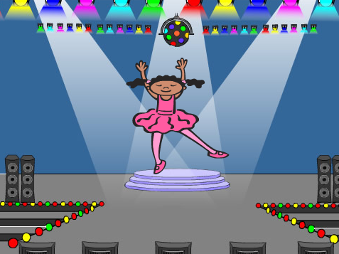
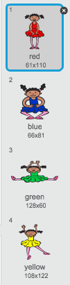
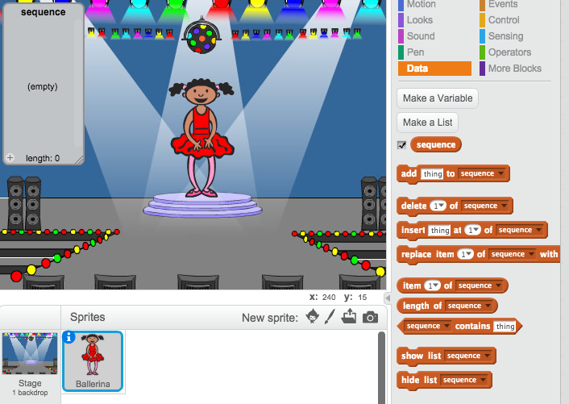
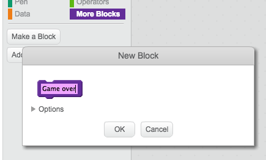

---
title: Paměť
level: Scratch 2
language: cs-CZ
stylesheet: scratch
embeds: "*.png"
materials: ["Club Leader Resources/*"]
...

## Komunitní projekt { .challenge .pdf-hidden }
Tento projekt byl vytvořen Erikem a jeho dcerou Ruth. Pokud chcete také přispět vlastním projektem potom můžete na [Githubu](https://github.com/CodeClub).

# Úvod { .intro }

V tomto projektu se naučíš jak vytovořit hru na cvičení paměťi, budeš se snažit zapamatovat si a zopakovat sekvenci náhodných barev!

<div class="scratch-preview">
  <iframe allowtransparency="true" width="485" height="402" src="http://scratch.mit.edu/projects/embed/34874510/?autostart=false" frameborder="0"></iframe>
  
</div>

# Krok 1: Náhodné barvy { .activity }

Jako první vytvoříme psotavu, která bude meěnit barvy v náhodné sekvenci a hráč si je zkusí zapamatovat.

## Seznam úkolů { .check }

+ Vytvoř si nový projekt a smaž kočičku, takže tvůj projekt bude prázdný. Online editor můžeš nalézt zde: <a href="http://jumpto.cc/scratch-new">jumpto.cc/scratch-new</a>.

+ Vyber si postavu a pozadí. Tvoje postava nemusí být člověk, ale musí umožňovat měnit a ukazovat různé barvy.

	

+ Ve hře použiješ různá čísla pro reprezentaci každé barvy:

	+ 1 = červená;
	+ 2 = modrá;
	+ 3 = zelená;
	+ 4 = žlutá.

	Vytvoř postavě 4 kostýmy, každý v jedné barvě. Ujisti se, že jsou barevné kostýmy ve správném pořadí.

	

+ Pro vytvoření náhodné sekvence musíš vytvořit __seznam__. Seznam je proměnná, která uschovává další data __v pořadí__. Vytvoř seznam nazvaný `sekvence` {.blockdata}. Protože seznam potřebuje vidět jen tato postava, zaškrtneme 'Jen pro tuto postavu'.

	

	Teď by měl být vidět na scéně vlevo nahoře prázdný seznam a přibýt bloky kódu pro práci s ním.

	

+ Add this code to your character, to add a random number to your list (and show the correct costume) 5 times:

	```blocks
		po kliknutí na ⚑
		zruš (všechno v) z [seznam v]
		opakuj (5) krát
			přidej (náhodné číslo od (1) do (4)) k [seznam v]
			změň kostým na (prvek (poslední v) z [seznam v])
			čekej (1) sekund
		end
	```

	všimni si, že musíš taky na začátku vyprázdnit seznam.

## Výzva: Přidání zvuků {.challenge}
Vyzkoušej projekt víckrát za sebou. Můžeš si všimnout, že se občas vybere stejná barva dvakrát nebo víckrát za sebou a je pak těžší zjsitit kolik jich bylo a zapamatovat si je. Přidej zvuk bubnu, pokaždé když postava změní kostým.

Zkus použít pokaždé jiný zvuk, aby odpovídal barvě. Toto je _velmi_ podobné tomu, jak měníš kostýmy.

## Ulož projekt { .save }

# Krok 2: Zopakování sekvence { .activity }

Přidej 4 tlačítka, kterýmí hráč zopakuje sekvenci barev, kterou si zapamatoval.

## Seznam úkolů { .check }

+ Přidej 4 objekty, které budou představovat tlačítka. Uprav je tak, aby každý měl jednu z barev.

	

+ Pokud klikneš na červený buben, je potřeba poslat zprávu postavě, a dát j vědět, že bylo stisknuto toto 'tlačítko'. Přidej k červenému bubnu tetno kód:

	```blocks
		po kliknutí na mě
		rozešli všem [cervena v]
	```

+ Když postava dostane tuto zprávu, podíváme se jestli na začatku seznamu je červená - říslo 1. Pokud ano, tak ji odstraníme ze seznamu, pokud ne, tak je konec hry!

	```blocks
		po obdržení zprávy [red v]
		když <(prvek (1 v) z [seznam v])=[1]> tak
			zruš (1 v) z [seznam v]
		jinak
			říkej [Konec hry!] příštích (1) sekund
			zastav [vše v]
		end
	```

+ Jakmile je list prázdný zobraz blikající světla, to znamená, že si hráč zapamatoval vše správně. Přidej tento kód do  kódu tvé postavy nakonec bloku `po kliknutí na ⚑` {.blockevents}:

	```blocks
		čekej dokud nenastatne < (délka [seznam v]) = [0]>
		rozešli všem [vyhra v] a čekej
	```

+ Klikni na scénu a přidej tento kód, který změní barvu pozadí, když gráč vyhraje:

	```blocks
		po obdržení zprávy [vyhra v]
		přehraj zvuk [drum machine v]
		opakuj (50) krát
			změň efekt [barva v] o (25)
			čekej (0.1) sekund
		end
		zruš grafické efekty
	```

## Výzva: Vytvoření 4 tlačítek {.challenge}
Zopakuj předchozí kroky pro ostatní tlačítka. Který kód zůstane stejný a který se mění?

Také můžeš přidat zvuk když jsou tlačítka stisknuta.

Nezapomeň přidaný kód otestovat! Dokážeš si zapamatovat kód pěti barev?

## Ulož projekt { .save }

# Krok 3: Více úrovní { .activity .new-page }

Doteď si hráč musel zapamatovat jen 5 barev. Vylepši hru tak, aby se délka sekvence prodlužovala.

## Seznam úkolů { .check }

+ Vytovř novou proměnnou nazvanou `score` {.blockdata}.

	

+ Toto `score` {.blockdata} bude použito pro rozhodování, kolik barev si má hráč zapamatovat. Na začátek ho nastavíme na 3. Přidej tent kód k tvé postavě na začátek bloku `po kliknutí na ⚑` {.blockevents}:

	```blocks
		nastav [score v] na [3]
	```

+ Místo vytváření sekvence 5 barev, použiješ tuto proměnnou `score` {.blockdata} pro počet barev, které se mají vygenerovat. Změn cyklus `opakuj` {.blockcontrol} u postavy pro vytváření sekvence takto:

	```blocks
		opakuj (score) krát
		end
	```

+ Pokud si hráč zapamatuje sekvenci správně, zvedni skóre o 1:

	```blocks
		změň [score v] o (1)
	```

+ Nakonec, musíš přidat smyčku `opakuj dokola` {.blockcontrol} kolem sekvence kódu na generování seznamu, tak aby se pro každou úroveň vytvořila nová sekvence. Takto by měl vypadat kód postavy:

	```blocks
		po kliknutí na ⚑
		nastav [score v] na [3]
		opakuj dokola
			zruš (všechno v) z [seznam v]
			opakuj (score) krát
				přidej (náhodné číslo od (1) do (4)) k [seznam v]
					změň kostým na (prvek (poslední v) z [seznam v]
				čekej (1) sekund
			end
			čekej dokud nenastane < (délka [seznam v]) = [0]>
			rozešli všem [vyhra v] a čekej
			změň [score v] o (1)
		end
	```

+ Nech kamarády otestovat hru. Nezapomeň schovat seznam `seznam` {.blockdata}!

## Ulož projekt { .save }

# Krok 4: Nejvyšší skóre { .activity }

Ukládej nejvyšší skóre, abyste mohli s kamarády hrát proti sobě.

## Seznam úkolů { .check }

+ Add 2 new variables to your project, called `high score` {.blockdata} and `name` {.blockdata}.

+ If ever the game ends (by pressing the wrong button), you need to check whether the player's score is higher than the current high score. If it is, you need to save the score as the high score, and store the name of the player. Here's how your red button should look:

	```blocks
		po obdržení zprávy [red v]
		if <(item (1 v) of [seznam v])=[1]> then
			delete (1 v) of [seznam v]
		else
			say [Game over!] for (1) secs
			if < (score) > (high score) > then
				set [high score v] to (score)
				ask [High score! What is your name?] a čekej
				set [name v] to (answer)
			end
			zastav [vše v]
		end
	```

+ You'll need to add this new code to the other 3 buttons too! Have you noticed that the 'Game over' code in each of the 4 buttons is exactly the same?

	

+ If ever you need to change any of this code, such as adding a sound or changing the 'Game over!' message, you'd have to change it 4 times! That could get annoying, and waste a lot of time.

	Instead, you can define your own blocks, and reuse them in your project! To do this, click `more blocks` {.blockmoreblocks}, and then 'Make a block'. Call this new block 'Game over'.

	

+ Add the code from the `else` {.blockcontrol} block from the red button to the new block that appears:

	

+ You've now made a new _function_ called `Game over` {.blockmoreblocks}, which you can use anywhere you like. Drag your new `Game over` {.blockmoreblocks} block onto the 4 scripts for the buttons.

	

+ Now add a sound for when the wrong button is pressed. You only need to add this code _once_ in the `Game over` {.blockmoreblocks} block that you made, and not 4 separate times!

	

## Výzva: Making more blocks {.challenge}
Do you notice any other code that is the same for all 4 buttons?


Can you make another custom block, that is used by each button?

## Ulož projekt { .save }

## Výzva: Another costume {.challenge}
Have you noticed that your game starts with your character showing one of the 4 colours, and that they always display the last colour in the sequence while the player is repeating the sequence?

Can you add another plain white costume to your character, which is displayed at the start of your game, and when the player is trying to copy the sequence?


## Ulož projekt { .save }

## Výzva: Difficulty level {.challenge}
Can you allow your player to choose between 'easy mode' (using just the red and blue drums) and 'normal mode' (which uses all 4 drums)?

You could even add a 'hard' mode, which makes use of a 5th drum!

## Ulož projekt { .save }
